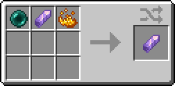
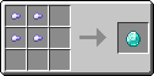
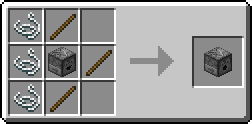
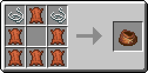
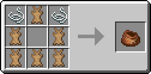
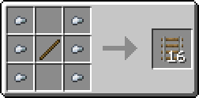
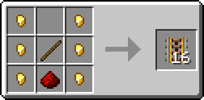
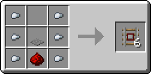
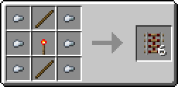

# Boring SMP
## Warp Stone
The Warp Stone item can be used to teleport to Lodestones. It works very similar to a compass, that can be bound to a Lodestone. You can bind a Warp Stone to a Lodestone by right clicking, and then always teleport back to the Lodestone.  
In case the Lodestone gets removed, your Warp Stone will no longer work.  

## Bucketable Entities
Most peaceful entities can be picked up by sneaking and right clicking it while holding a bucket. You will now have a bucket with that entity inside, which can be  
- Allays
- Armadillos
- Bees
- Camels
- Chickens
- Cows
- Donkeys
- Foxes
- Frogs
- Goats
- Horses
- Llamas
- Mules
- Ocelots
- Pandas
- Pigs
- Rabbit
- Sheeps
- Villagers
- Zombie Villagers

## Diamond Shards
A Diamond Shard is equivilant to 0.25 Diamonds. They exist for the economy, so that you can sell items for cheaper if a Diamond isn't cheap enough.  
They can also be obtained by smelting diamond gear.  

## 100% Villager Conversion Rate
Due to the server's difficulty being set to Normal, Villagers would usually only successfully convert to Zombie Villagers 50% of the time. The Mod changes this so that Villagers convert successfully 100% of the time.

## Crafting Tweaks
- Dispensers without bows  

- Bundles from Leather and Rabbit Hide  

- Rails are crafted with nuggets instead of ingots.  

- You can decompress Wool back into String, Nether Wart Blocks, and all ice variants
- Rotten Flesh can be smelted into leather
- Shapeless Bread, Paper and Shulker Boxes
