# Claims
## Anchors
Name       | Radius in blocks | Recipe
-----------|------------------|--------------------------------------
Makeshift  | 10               | 
Reinforced | 25               | 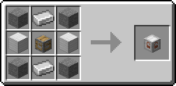
Glistening | 50               | 
Crystal    | 75               | 
Emeradic   | 125              | 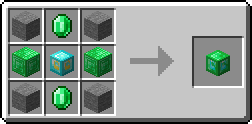
Withered   | 200              | 

## Upgrades
Anchors can be upgraded by using Upgrade Kits. These can be used to upgrade a lower tier anchor to a higher tier enchor. For example, a Makeshift Anchor can be upgraded to a Reinforced Anchor by using a Reinforced Upgrade Kit.

Name                   | Recipe
-----------------------|--------------------------------------
Reinforced Upgrade Kit | 
Glistening Upgrade Kit | 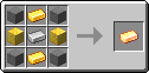
Crystal Upgrade Kit    | 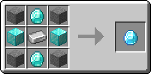
Emeradic Upgrade Kit   | 
Withered Upgrade Kit   | 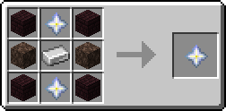

## Augments
An anchors feature set can be extended using Augments. These are blocks that need to be placed next to your claim anchor.

Name                 | Function                                           | Recipe
---------------------|----------------------------------------------------|----------
Ender Binding        | Prevents Endermen from teleporting                 | 
Lake Spirit's Grace  | Grants players water breathing and dolphin's grace | 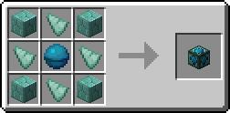
Angelic Auroa        | Grants players regeneration                        | 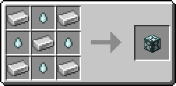
Heaven's Wings       | Grants players flight                              | 
Village Core         | Protects vilalgers from hostile mobs               | 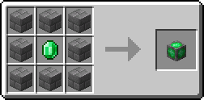
Withering Seal       | Prevents players from getting the wither effect    | 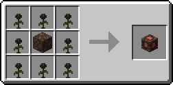
Chaos Zone           | Grants players strength                            | 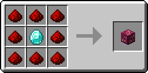
Greeter              | Sends a message to players entering your claim     | 
PvP Arena            | Allows toggeling PvP                               | 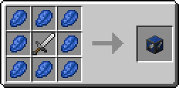
Explosion Controller | Allows toggeling of explosions                     | 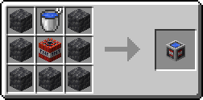

## Goggles of Claim Revealing
You can craft Goggles of Claim Revealing to reveal claim borders.  
You can either wear them on your head or hold them in any of your hands to see the borders. Be aware that it only has one durability, so when wearing it be careful.  
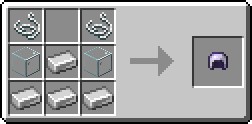

## Exceptions
While claims protect the majority of your entities and blocks, there are some exceptions.
- Ender chests
- Crafting tables
- Stonecutters
- Smithing Tables
- Grindstones
- Anvils
- Note Block
- All button types
- All boat types
- All chest boat types
- Minecarts

## Links
- [Modrinth](https://modrinth.com/mod/goml-reserved)
