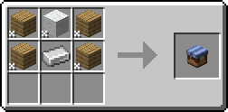

# Shops
Shops give players the possibility to sell and buy items.

## Selling
If you want to sell items, your best location is the Shopping District. In order to create a shop, please ask a moderator for a plot, otherwise your shop will be removed. The moderator will create a claim for you with the exact dimensions you need.  
If the Shopping District is not a viable option for you, you are free to build your shop anywhere else without asking a moderator.

Once you built your house, you can now stock it with items. You firstly need to craft a Trade Shop, which can be placed on any storage container, e.g. barrel.  

Once placed down, it will complain that it is unconfigured. To configure it, right click the shop to open up it's menu. There you have multiple options for the price, stock and the hologram.
### Price Type
- Item: For one item spent, the buyer can buy one stock.
- Free: The stock is free to take. This is useful for public farms, where you want to make the output chests available to everyone.

### Stock Type
- Equal Item: The buyer gets one of the selected item per purchase made.
- Any Stack: The buyer can choose to buy any item from the storage container.

### Hologram
- Full: An icon of the stock, the stock's name, and the price will be shown.
- Icon only: An icon of the stock will be shown.
- Disabled: Nothing is shown.

## Buying
Buying an item is easy. Right click any shop and a GUI will open up. You will see the price of one stock on the left. Be sure to have it in your inventory, as the item will be taken from your inventory when you purchase an item.  
To purchase an item, just click on the stock item, your payment will be made and you will have the displayed item in your cursor. You can also hold shift in order to put the item instantly in your inventory.

## Links
- [Modrinth](https://modrinth.com/mod/universal-shops)
